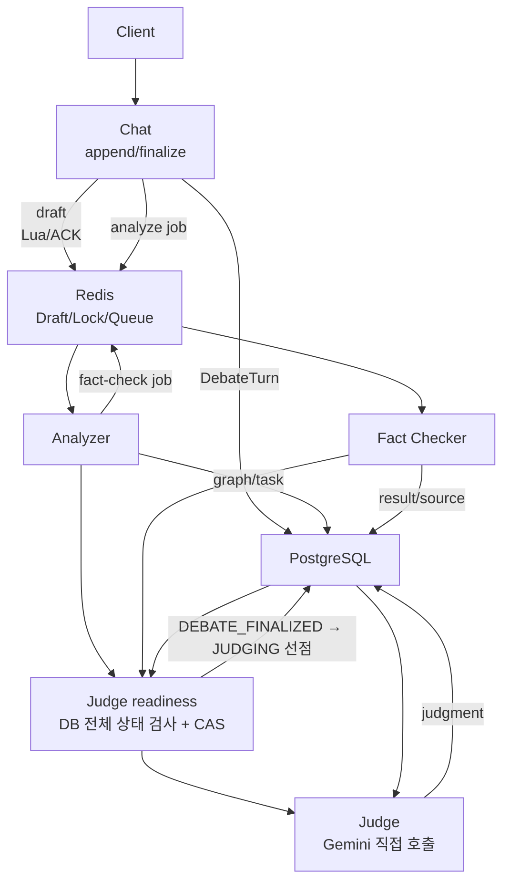
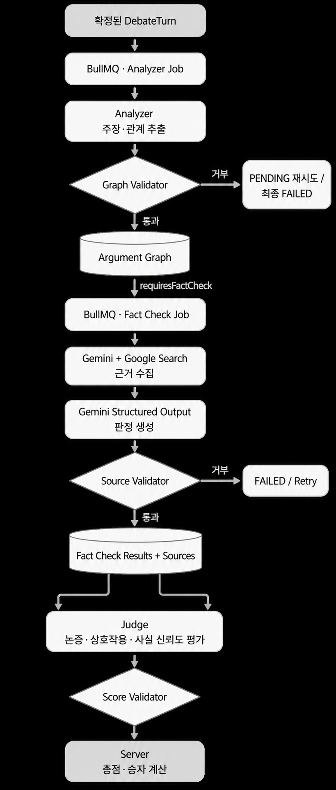
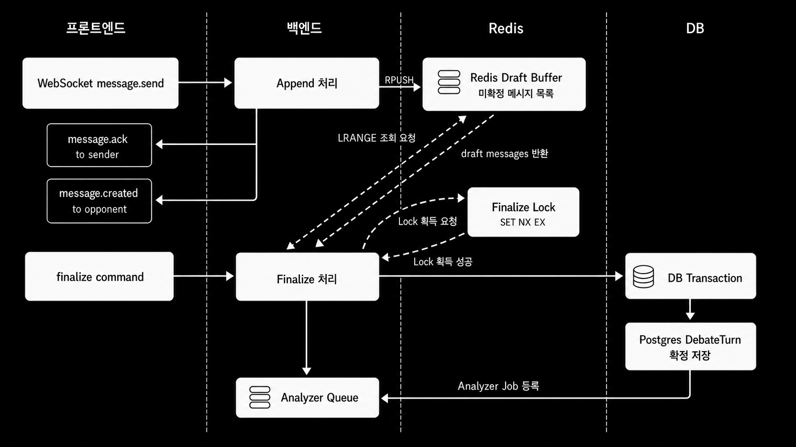
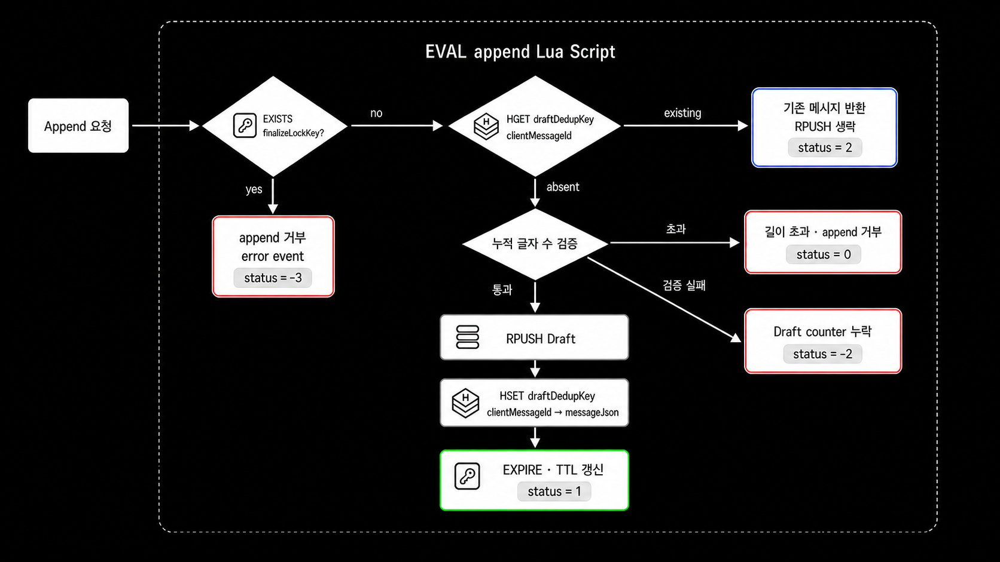
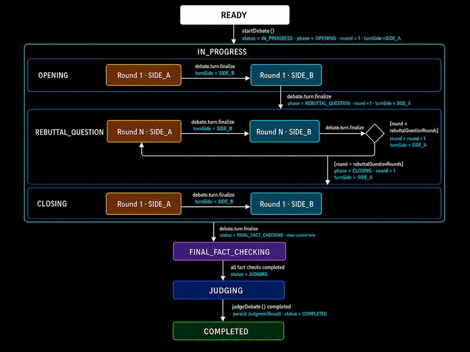
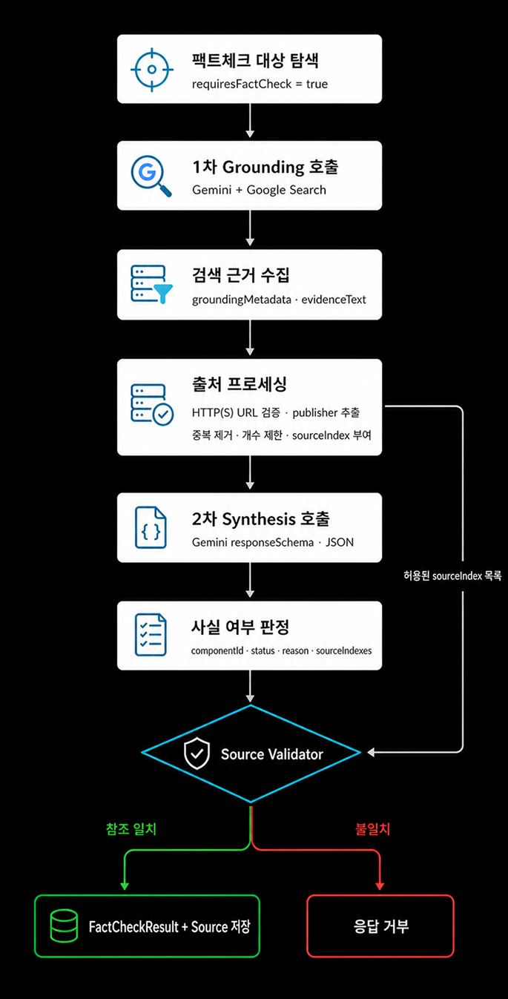

# Heimdall AI

실시간 토론, 커뮤니티, 인증과 AI 분석 파이프라인을 제공하는 NestJS 백엔드입니다. 실행 가능한 애플리케이션은 [`backend`](./backend) 디렉터리에 있습니다.

## Tech Stack

- NestJS, TypeScript
- TypeORM, PostgreSQL
- BullMQ, Redis
- Gemini API (`@google/genai`)
- WebSocket (`ws`)

## Core Features



<p align="center">
  
</p>

채팅 메시지는 Redis Draft Buffer에서 턴 단위 발언으로 확정되고, 확정된 `DebateTurn`은 Analyzer와 Fact Checker를 거칩니다. Analyzer와 Fact Checker는 완료 후 공통 readiness 검사를 호출하며, 전체 DB 상태가 준비된 한 요청만 `DEBATE_FINALIZED → JUDGING`을 선점해 Judge API를 직접 실행합니다. Judge에는 별도 BullMQ Queue나 Task 테이블이 없습니다. 각 단계의 Gemini 응답은 프롬프트와 `responseSchema`로 형태를 제한하고, 저장 전 백엔드 Validator로 다시 검증합니다.

인증은 access/refresh JWT를 사용합니다. 커뮤니티, 멤버십, 기조 발언(`community_opinion`), 영속 채팅 메시지와 토론 의사를 PostgreSQL에 저장하며, 커뮤니티 채팅과 토론 채팅은 하나의 WebSocket 서버에서 경로별 room으로 브로드캐스트합니다.

### Chatting

실시간 채팅 UX와 턴 단위 DB 저장/AI 분석 경계를 분리하는 단계입니다.

**Message Append**

- WebSocket `message.send`는 DB에 바로 저장하지 않고 Redis Draft Buffer에 append합니다.
- Redis Lua Script 하나로 finalize lock 확인, `clientMessageId` dedup 확인, 누적 글자 수 검증, `RPUSH`, counter 갱신, TTL 갱신을 처리합니다.
- append 검증과 저장을 Redis 내부에서 원자화해 동시 append 상황에서도 턴당 1000자 제한 초과를 방지합니다.
- WebSocket 위에 `clientMessageId` 기반 ACK 프로토콜을 설계해 전송자 ACK와 상대방 broadcast를 분리하고, 재전송 중복 전파를 막습니다.

**DebateTurn Finalize**

- `turn.finalize`는 Redis Draft 메시지를 읽어 하나의 `DebateTurn.content`로 병합하고 DB transaction으로 확정 저장합니다.
- Redis `SET NX EX` 기반 finalize lock으로 확정 중 append가 끼어드는 상황을 차단합니다.
- lock 해제 시 owner token을 비교해, 다른 요청이 잡은 lock을 잘못 삭제하지 않도록 방어합니다.
- 확정된 `DebateTurn`만 Analyzer Queue에 등록해 AI 파이프라인 입력 단위를 턴 기준으로 고정합니다.
- 토론 진행 단계를 서버 주도 상태 머신으로 모델링하고, 턴 소유자, phase, round, 시간 제한과 다음 턴 상태 전이를 서버 기준으로 제어합니다.
- 서버 스케줄러가 입론/최종발언은 90초, 반론 및 질문은 180초에 자동 finalize합니다.
- 전체 토론은 시작 후 27분이 지나면 진행 상태와 무관하게 실패 종료하고, 실행 중인 AI 호출과 Analyzer/Fact Check Job을 취소합니다.
- 참가자가 기권하면 동일한 종료 경로를 사용하고 상대 참가자 점수에 20점을 부여합니다.

<p align="center">
  
</p>

<p align="center">
  
</p>

<p align="center">
  
</p>

### Analyzer

확정된 `DebateTurn`을 논증 요소와 관계로 구조화하는 단계입니다.

**AI Prompt 핵심**

- 현재 턴의 `content`만 신규 component 추출 대상으로 사용하고, 누적 그래프는 기존 component 참조 대상으로만 사용합니다.
- 새 component는 DB ID가 아닌 `NEW_1`, `NEW_2` 형태의 `localKey`로 표현하도록 지시합니다.
- relation은 `NEW -> NEW`, `NEW -> EXISTING` 방향만 허용하고, `EXISTING -> NEW`, `EXISTING -> EXISTING`은 생성하지 않도록 제한합니다.
- `SUPPORTS`, `ATTACKS`, `QUESTIONS`, `ANSWERS`의 의미를 프롬프트에 정의하고, 불명확한 관계는 억지로 만들지 않도록 지시합니다.
- 한국어 토론 표현은 키워드 매칭이 아니라 담화 의도 기준으로 해석하도록 지시합니다.

**Backend 검증 규칙**

- `localKey` 형식과 중복, 누락된 `NEW`/`EXISTING` 참조, 자기 참조를 검증합니다.
- 동일 relation 중복과 같은 `from/to`의 `SUPPORTS`/`ATTACKS`, `QUESTIONS`/`ANSWERS` 충돌을 차단합니다.
- Major Claim은 `OPENING`에서만 허용하고, 참가자당 최대 하나로 제한합니다.
- statement 공백/길이, component 개수, fact-check target 개수 제한을 검증합니다.
- Mapper는 검증된 `localKey`를 UUID로 치환하고, component/relation/fact-check target 생성과 `analysisStatus=COMPLETED` 전환을 하나의 transaction으로 저장합니다.
- BullMQ Worker는 `PENDING -> PROCESSING -> COMPLETED/FAILED` 상태 전이를 사용하며, 재시도 가능한 실패는 다시 `PENDING`으로 되돌려 중복 실행과 조기 실패를 방지합니다.
- 복구 Scheduler는 유실된 `PENDING` Job을 결정적 Job ID로 재등록하고, lease가 만료된 `PROCESSING`을 `PENDING`으로 회수합니다.

<p align="center">
  
</p>

### Fact Checker

Grounding 기반 출처 탐색과 사실 판정 결과 생성을 분리하고, 판정 결과와 출처 간 참조 무결성을 보장하는 팩트체크 파이프라인입니다.

- `requiresFactCheck=true`인 component를 Turn 단위 `FactCheckBatchTask`로 묶어 처리합니다.

**AI Prompt 핵심**

- Grounding 프롬프트는 각 target을 독립적으로 검토하고, 공식 통계/공공기관/학술 자료/원문 문서/신뢰 가능한 원보도를 우선 탐색하도록 지시합니다.
- Grounding 단계는 판정 JSON을 만들지 않고, 근거 텍스트와 Gemini `groundingMetadata` 기반 출처 후보 수집에 집중합니다.
- 서버가 출처 URL 검증, 중복 제거, `sourceIndex` 부여를 끝낸 뒤에만 Synthesis 프롬프트에 허용 출처 목록을 전달합니다.
- Synthesis 프롬프트는 모든 input target에 정확히 하나의 result를 반환하고, URL 직접 생성 없이 허용된 `sourceIndex`만 참조하도록 제한합니다.
- 근거가 부족하거나 검증 불가능하거나 최신성이 중요한 주장은 무리하게 확정하지 않고 검증 불가 계열 status로 분류하도록 지시합니다.

**Backend 검증 규칙**

- Output result 수와 input target 수가 일치하는지 검증합니다.
- input에 없는 `componentId` 반환, 동일 `componentId` 중복, target 결과 누락을 차단합니다.
- `VerificationStatus`, reason 공백/길이, result별 source 개수 제한을 검증합니다.
- `sourceIndex`가 Gemini `groundingMetadata`에서 추출한 허용 출처 목록에 존재하는지 검증합니다.
- 같은 result 안의 중복 source를 제거하고, Result/Source 저장과 BatchTask `COMPLETED` 전환을 하나의 transaction으로 처리합니다.
- 검증 불가(`NOT_VERIFIABLE`, `INSUFFICIENT_EVIDENCE`, `OUTDATED_OR_TIME_SENSITIVE`)는 시스템 실패가 아닌 정상 도메인 결과로 저장합니다.
- 복구 Scheduler는 `PENDING` Task를 재등록하고 오래된 `PROCESSING` Task를 회수합니다.

<p align="center">
  
</p>

### Judge

논증 구조와 사실 검증 결과를 종합해 최종 판정을 생성하는 단계입니다.

**AI Prompt 핵심**

- 완성된 argument graph와 fact-check 결과를 입력으로 평가하도록 지시합니다.
- 평가 기준은 Argumentation, Interaction, Factual Reliability 세 가지로 제한합니다.
- SIDE_A/SIDE_B의 항목별 점수와 피드백만 반환하도록 제한합니다.
- Gemini 응답에는 `totalScore`, `winner`, schema 밖의 필드를 포함하지 않도록 지시합니다.

**Backend 검증 규칙**

- Judge 실행 전 Debate 상태가 `JUDGING`인지, 모든 Analyzer와 FactCheckBatchTask가 완료됐는지 검증합니다.
- fact-check 대상 component의 FactCheckResult 누락/중복을 차단합니다.
- relation 양 끝 component 존재 여부, relation 자기 참조, speakerId와 speakerSide 일치 여부를 검증합니다.
- 점수는 정수이며 Argumentation `0~40`, Interaction `0~30`, Factual Reliability `0~30` 범위인지 검증합니다.
- `overallReason`, `sideAFeedback`, `sideBFeedback` 공백/길이 제한을 검증합니다.
- 총점과 승자는 백엔드가 결정론적으로 계산하고, `JudgmentResult` 저장과 Debate `COMPLETED` 전환을 하나의 transaction으로 처리합니다.
- Analyzer와 Fact Checker 완료 시마다 readiness를 검사하되, 모든 Turn 분석 완료, 모든 Fact Check Task 완료, 필요한 Component의 실제 FactCheckResult 존재, 기존 JudgmentResult 부재를 모두 확인합니다.
- 조건부 UPDATE로 한 실행만 `JUDGING`을 선점하며, 선점한 애플리케이션 프로세스가 Judge Gemini API를 직접 호출합니다.
- 정상 판정의 승자 점수 20점 증가, `JudgmentResult` 저장, Debate `COMPLETED` 전환과 Community `WAITING` 복귀를 같은 DB transaction에서 처리합니다.
- Judge가 `JUDGING`에서 멈추면 `POST /debates/:debateId/judge/retry`가 기본 5분 stale 기준으로 재선점할 수 있습니다. 현재 프론트엔드에는 이 수동 재시도 API가 연결되어 있지 않습니다.

## Setup

요구 사항:

- Node.js와 npm
- Docker Desktop 또는 Docker Engine + Compose plugin
- Flutter 클라이언트까지 실행한다면 Flutter SDK와 대상 플랫폼 도구

저장소의 `heimdall_ai` 디렉터리를 기준으로 다음을 실행합니다.

```bash
cd backend
npm ci
cp .env.example .env
```

`.env`의 두 JWT secret을 각각 32자 이상의 임의 문자열로 바꾸고 `GEMINI_API_KEY`를 설정합니다. 빈 Gemini key로 서버 자체는 시작할 수 있지만 AI 작업은 수행할 수 없습니다. 로컬 기본 DB는 `localhost:5433/heimdall_db`, Redis는 `localhost:6379`입니다.

## Run Infrastructure

```bash
docker compose up -d postgres redis redisinsight
```

- PostgreSQL: `localhost:5433`
- Redis: `localhost:6379`
- RedisInsight: `http://localhost:5540`

## Database

```bash
npm run migration:run
npm run migration:show
```

마이그레이션에는 현재 스키마뿐 아니라 개발용 커뮤니티/멤버/메시지/기조 발언 seed도 포함됩니다. 새 데이터베이스에서는 서버를 실행하기 전에 먼저 적용해야 합니다.

## Run Server

```bash
npm run start:dev
```

- HTTP: `http://localhost:3000`
- Debate/Community Chat WebSocket: `ws://localhost:8080`
- Debate 경로: `/debates/:debateId/chat`
- Community 경로: `/communities/:communityId/chat`

`EADDRINUSE`가 발생하면 같은 포트의 기존 백엔드/WebSocket 프로세스를 종료하거나 `.env`의 `PORT`, `DEBATE_CHAT_WS_PORT`를 변경합니다. 포트를 변경했다면 프론트엔드의 세 URL도 함께 맞춰야 합니다.

## Verification

```bash
npm test -- --runInBand
npm run build
```
