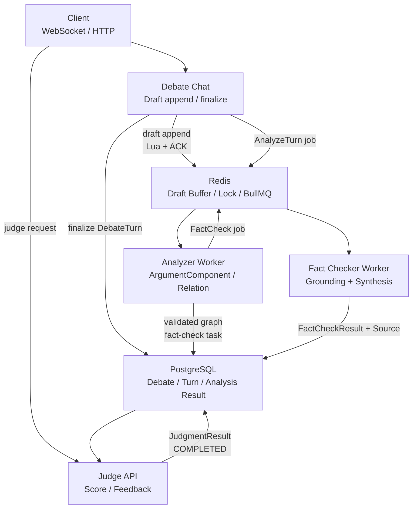
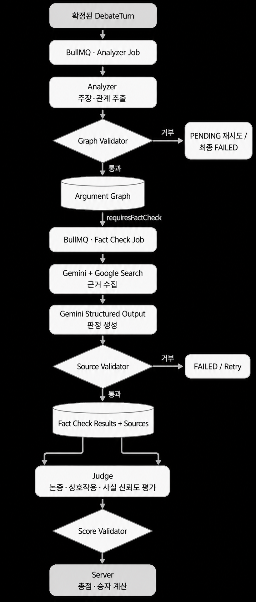
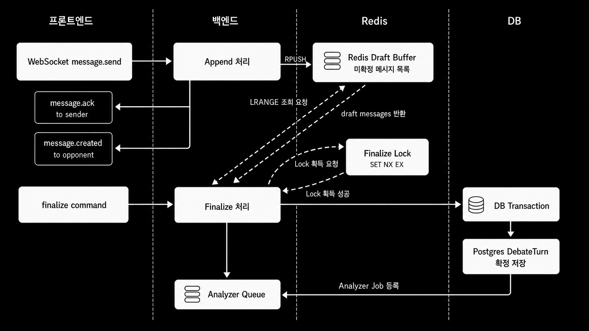
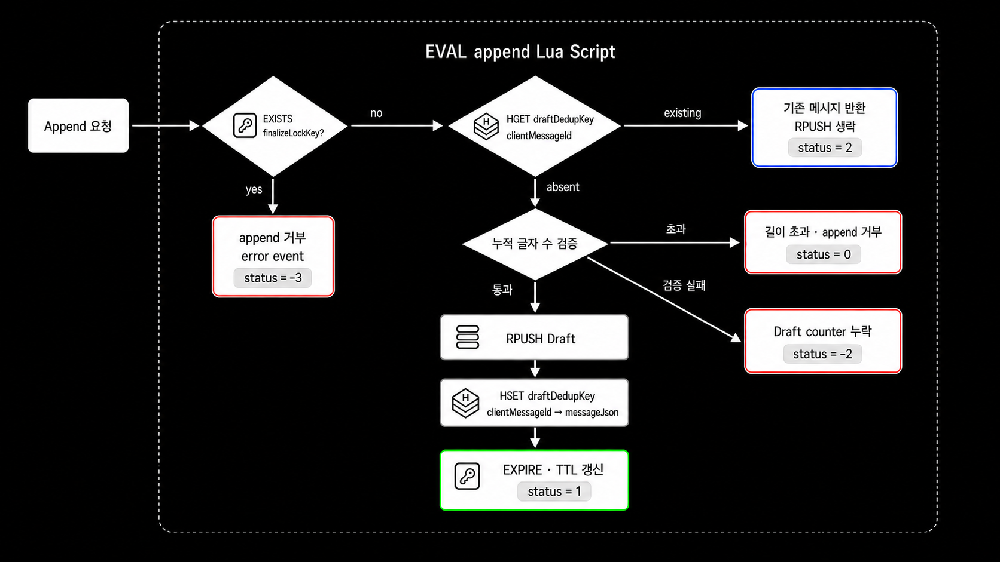
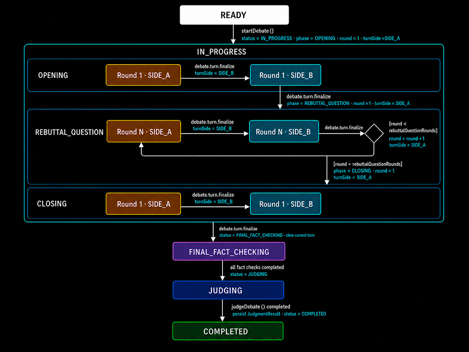
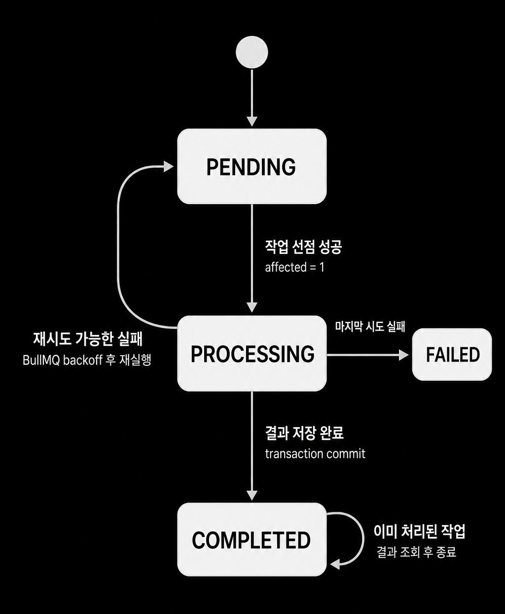
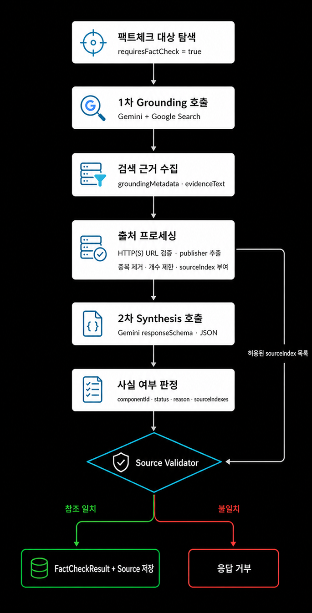

# Heimdall AI Backend

AI가 토론 발언의 논증 구조와 사실 여부를 분석하고, 최종 판정을 생성하는 NestJS 백엔드입니다.

## Tech Stack

- NestJS, TypeScript
- TypeORM, PostgreSQL
- BullMQ, Redis
- Gemini API (`@google/genai`)
- WebSocket (`ws`)

## Core Features





채팅 메시지는 Redis Draft Buffer에서 턴 단위 발언으로 확정되고, 확정된 `DebateTurn`은 Analyzer, Fact Checker, Judge를 순차적으로 거칩니다. 각 단계의 Gemini 응답은 프롬프트와 `responseSchema`로 형태를 제한하고, 저장 전 백엔드 Validator로 다시 검증합니다.

### Chatting

실시간 채팅 UX와 턴 단위 DB 저장/AI 분석 경계를 분리하는 단계입니다.

**Message Append**

- WebSocket `message.send`는 DB에 바로 저장하지 않고 Redis Draft Buffer에 append합니다.
- Redis Lua Script 하나로 finalize lock 확인, `clientMessageId` dedup 확인, 누적 글자 수 검증, `RPUSH`, counter 갱신, TTL 갱신을 처리합니다.
- append 검증과 저장을 Redis 내부에서 원자화해 동시 append 상황에서도 턴당 1000자 제한 초과를 방지합니다.
- WebSocket 위에 `clientMessageId` 기반 ACK 프로토콜을 설계해 전송자 ACK와 상대방 broadcast를 분리하고, 재전송 중복 전파를 막습니다.

**DebateTurn Finalize**

- `turn.finalize`는 Redis Draft 메시지를 읽어 하나의 `DebateTurn.content`로 병합하고 DB transaction으로 확정 저장합니다.
- Redis `SET NX EX` 기반 finalize lock으로 확정 중 append가 끼어드는 상황을 차단합니다.
- lock 해제 시 owner token을 비교해, 다른 요청이 잡은 lock을 잘못 삭제하지 않도록 방어합니다.
- 확정된 `DebateTurn`만 Analyzer Queue에 등록해 AI 파이프라인 입력 단위를 턴 기준으로 고정합니다.
- 토론 진행 단계를 서버 주도 상태 머신으로 모델링하고, 턴 소유자, phase, round, 시간 제한과 다음 턴 상태 전이를 서버 기준으로 제어합니다.







### Analyzer

확정된 `DebateTurn`을 논증 요소와 관계로 구조화하는 단계입니다.

**AI Prompt 핵심**

- 현재 턴의 `content`만 신규 component 추출 대상으로 사용하고, 누적 그래프는 기존 component 참조 대상으로만 사용합니다.
- 새 component는 DB ID가 아닌 `NEW_1`, `NEW_2` 형태의 `localKey`로 표현하도록 지시합니다.
- relation은 `NEW -> NEW`, `NEW -> EXISTING` 방향만 허용하고, `EXISTING -> NEW`, `EXISTING -> EXISTING`은 생성하지 않도록 제한합니다.
- `SUPPORTS`, `ATTACKS`, `QUESTIONS`, `ANSWERS`의 의미를 프롬프트에 정의하고, 불명확한 관계는 억지로 만들지 않도록 지시합니다.
- 한국어 토론 표현은 키워드 매칭이 아니라 담화 의도 기준으로 해석하도록 지시합니다.

**Backend 검증 규칙**

- `localKey` 형식과 중복, 누락된 `NEW`/`EXISTING` 참조, 자기 참조를 검증합니다.
- 동일 relation 중복과 같은 `from/to`의 `SUPPORTS`/`ATTACKS`, `QUESTIONS`/`ANSWERS` 충돌을 차단합니다.
- Major Claim은 `OPENING`에서만 허용하고, 참가자당 최대 하나로 제한합니다.
- statement 공백/길이, component 개수, fact-check target 개수 제한을 검증합니다.
- Mapper는 검증된 `localKey`를 UUID로 치환하고, component/relation/fact-check target 생성과 `analysisStatus=COMPLETED` 전환을 하나의 transaction으로 저장합니다.
- BullMQ Worker는 `PENDING -> PROCESSING -> COMPLETED/FAILED` 상태 전이를 사용하며, 재시도 가능한 실패는 다시 `PENDING`으로 되돌려 중복 실행과 조기 실패를 방지합니다.



### Fact Checker

검증 대상 주장을 검색 근거와 연결해 저장 가능한 `FactCheckResult`로 정규화하는 단계입니다.

- `requiresFactCheck=true`인 component를 Turn 단위 `FactCheckBatchTask`로 묶어 처리합니다.

**AI Prompt 핵심**

- 1차 Gemini 호출은 Google Search Grounding을 사용해 각 target의 근거를 독립적으로 수집합니다.
- 공식 통계, 공공기관, 학술 자료, 원문 문서, 신뢰 가능한 원보도를 우선하도록 지시합니다.
- 근거가 부족하거나 최신성이 중요한 주장은 억지로 확정 판정하지 않도록 지시합니다.
- 2차 Gemini 호출은 구조화된 JSON 결과만 생성하며, 모든 input target에 정확히 하나의 result를 반환하도록 제한합니다.
- URL 직접 생성을 금지하고, 서버가 제공한 `sourceIndex`만 참조하도록 지시합니다.

**Backend 검증 규칙**

- Output result 수와 input target 수가 일치하는지 검증합니다.
- input에 없는 `componentId` 반환, 동일 `componentId` 중복, target 결과 누락을 차단합니다.
- `VerificationStatus`, reason 공백/길이, result별 source 개수 제한을 검증합니다.
- `sourceIndex`가 Gemini `groundingMetadata`에서 추출한 허용 출처 목록에 존재하는지 검증합니다.
- 같은 result 안의 중복 source를 제거하고, Result/Source 저장과 BatchTask `COMPLETED` 전환을 하나의 transaction으로 처리합니다.
- 검증 불가(`NOT_VERIFIABLE`, `INSUFFICIENT_EVIDENCE`, `OUTDATED_OR_TIME_SENSITIVE`)는 시스템 실패가 아닌 정상 도메인 결과로 저장합니다.



### Judge

논증 구조와 사실 검증 결과를 종합해 최종 판정을 생성하는 단계입니다.

**AI Prompt 핵심**

- 완성된 argument graph와 fact-check 결과를 입력으로 평가하도록 지시합니다.
- 평가 기준은 Argumentation, Interaction, Factual Reliability 세 가지로 제한합니다.
- SIDE_A/SIDE_B의 항목별 점수와 피드백만 반환하도록 제한합니다.
- Gemini 응답에는 `totalScore`, `winner`, schema 밖의 필드를 포함하지 않도록 지시합니다.

**Backend 검증 규칙**

- Judge 실행 전 Debate 상태가 `JUDGING`인지, 모든 Analyzer와 FactCheckBatchTask가 완료됐는지 검증합니다.
- fact-check 대상 component의 FactCheckResult 누락/중복을 차단합니다.
- relation 양 끝 component 존재 여부, relation 자기 참조, speakerId와 speakerSide 일치 여부를 검증합니다.
- 점수는 정수이며 Argumentation 0~40, Interaction 0~30, Factual Reliability 0~30 범위인지 검증합니다.
- overallReason, sideAFeedback, sideBFeedback 공백/길이 제한을 검증합니다.
- 총점과 승자는 백엔드가 결정론적으로 계산하고, `JudgmentResult` 저장과 Debate `COMPLETED` 전환을 하나의 transaction으로 처리합니다.

## Setup

```bash
npm install
cp .env.example .env
```

`.env`에 `GEMINI_API_KEY`를 설정합니다. 로컬 기본 DB는 `localhost:5433/heimdall_db`, Redis는 `localhost:6379`입니다.

## Run Infrastructure

```bash
docker compose up -d postgres redis redisinsight
```

- PostgreSQL: `localhost:5433`
- Redis: `localhost:6379`
- RedisInsight: `http://localhost:5540`

## Database

```bash
npm run migration:run
npm run migration:show
```

## Run Server

```bash
npm run start:dev
```

- HTTP: `http://localhost:3000`
- Debate Chat WebSocket: `ws://localhost:8080`

## Verification

```bash
npm test -- --runInBand
npm run build
```
