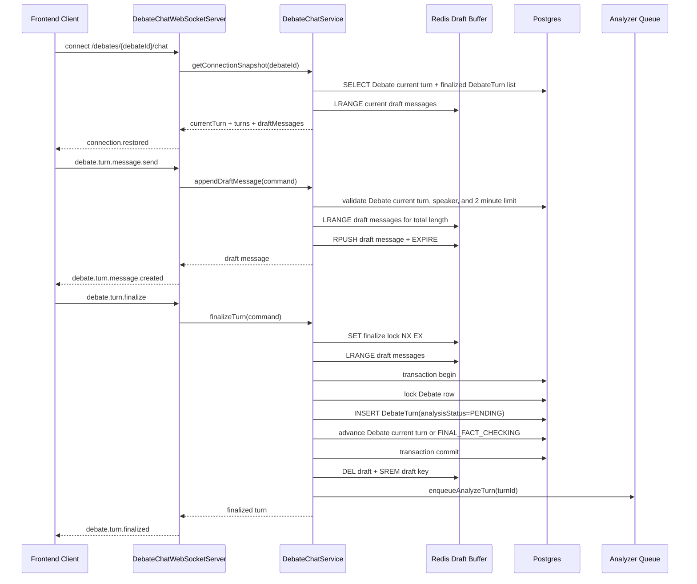

# Debate Chat WebSocket Contract

## 구조 요약

토론 채팅은 실시간 표시 단위와 분석 단위를 분리한다.

턴이 확정되기 전 사용자가 보내는 채팅 조각은 `DebateTurn`에 바로 저장하지
않는다. 대신 Redis draft buffer에 append하고, 같은 토론 방에 WebSocket으로
broadcast한다. 이 단계의 메시지는 프론트 화면에 실시간 말풍선처럼 보여주기 위한
임시 데이터다.

참여자가 턴을 확정하면 서버는 Redis draft buffer에 쌓인 메시지들을 순서대로
읽어서 하나의 문자열로 합친다. 그 결과를 `DebateTurn.content`로 Postgres에
insert하고, `analysisStatus=PENDING` 상태로 만든다. 그 다음 확정이 끝난 Redis
draft를 삭제하고 Analyzer job을 등록한다. 이후 `Debate.currentPhase`,
`Debate.currentRound`, `Debate.currentTurnSide`,
`Debate.currentTurnStartedAt`를 다음 턴으로 갱신한다.

따라서 프론트는 접속 시 두 종류의 데이터를 합쳐서 화면을 구성한다.

- `turns`: DB에 저장된 확정 턴 목록
- `draftMessages`: Redis에 남아 있는 현재 진행 중 턴의 임시 메시지 목록
- `currentTurn`: DB에 저장된 현재 턴 상태와 제한값

```text
턴 확정 전 메시지: DB current turn 검증 + Redis draft buffer + WebSocket broadcast
턴 확정 후 발언: Postgres DebateTurn insert + Debate current turn 갱신 + Analyzer enqueue
```

## Sequence Diagram



## Endpoint

```text
ws://localhost:8080/debates/{debateId}/chat
```

`DEBATE_CHAT_WS_PORT` controls the WebSocket port. The default is `8080`.

## Client Commands

### debate.turn.message.send

Appends one in-progress message to the Redis turn draft and broadcasts it to the
debate room. This does not create a `DebateTurn` row and does not trigger
Analyzer.

턴 확정 전 메시지를 Redis draft buffer에 저장한다. 이 명령은 프론트 실시간
표시용이며, DB에 `DebateTurn`을 만들지 않고 Analyzer도 호출하지 않는다.
서버는 DB의 current turn 상태와 요청 payload가 일치하는지 검증하고,
`currentTurnStartedAt + 120초`가 지나면 새 메시지를 거부한다. 한 턴의 Redis
draft 메시지 content 합산은 최대 1000자다.

```json
{
  "id": "command-1",
  "type": "debate.turn.message.send",
  "debateId": "optional-url-debate-id-match",
  "clientMessageId": "client-message-1",
  "payload": {
    "speakerId": "uuid",
    "speakerSide": "SIDE_A",
    "phase": "OPENING",
    "round": 1,
    "content": "turn content"
  },
  "sentAt": "2026-07-12T00:00:00.000Z"
}
```

`speakerSide` must be `SIDE_A` or `SIDE_B`.
`phase` must be one of the debate phase enum values.

### debate.turn.finalize

Reads the current Redis draft messages, joins them into one `DebateTurn.content`,
stores the finalized turn in Postgres, enqueues Analyzer, then clears the Redis
draft. The same transaction advances `Debate.current*` to the next turn. After
`CLOSING` `SIDE_B` is finalized, the debate status becomes
`FINAL_FACT_CHECKING`.

현재 턴의 Redis draft 메시지를 읽어서 하나의 `DebateTurn.content`로 확정한다.
이때만 DB에 `DebateTurn`을 insert하고 Analyzer job을 등록한다. 같은 턴의 중복
확정을 막기 위해 Redis finalize lock을 사용한다.

```json
{
  "id": "command-2",
  "type": "debate.turn.finalize",
  "debateId": "optional-url-debate-id-match",
  "payload": {
    "speakerId": "uuid",
    "speakerSide": "SIDE_A",
    "phase": "OPENING",
    "round": 1
  }
}
```

## Server Events

### connection.restored

Sent when the socket connects. Existing turns are sorted by `sequence`.

```json
{
  "id": "event-1",
  "type": "connection.restored",
  "debateId": "uuid",
  "currentTurn": {
    "phase": "OPENING",
    "round": 1,
    "turnSide": "SIDE_A",
    "startedAt": "2026-07-12T00:00:00.000Z",
    "maxDurationSeconds": 120,
    "maxTotalCharacters": 1000
  },
  "turns": [],
  "draftMessages": []
}
```

### debate.turn.message.created

Broadcast to every socket connected to the same debate room after a draft message
is appended to Redis.

```json
{
  "id": "event-2",
  "type": "debate.turn.message.created",
  "debateId": "uuid",
  "message": {
    "id": "uuid",
    "debateId": "uuid",
    "clientMessageId": "client-message-1",
    "speakerId": "uuid",
    "speakerSide": "SIDE_A",
    "phase": "OPENING",
    "round": 1,
    "content": "turn content",
    "createdAt": "2026-07-12T00:00:00.000Z"
  }
}
```

### debate.turn.finalized

Broadcast after the draft is finalized into a `DebateTurn` row.

```json
{
  "id": "event-3",
  "type": "debate.turn.finalized",
  "debateId": "uuid",
  "turn": {
    "id": "uuid",
    "debateId": "uuid",
    "clientMessageId": "client-message-1",
    "speakerId": "uuid",
    "speakerSide": "SIDE_A",
    "phase": "OPENING",
    "round": 1,
    "sequence": 1,
    "content": "turn content",
    "createdAt": "2026-07-12T00:00:00.000Z"
  }
}
```

### error

```json
{
  "id": "event-4",
  "type": "error",
  "debateId": "uuid",
  "commandId": "command-1",
  "code": "DebateChatInputError",
  "message": "speakerId does not match SIDE_A speaker."
}
```
